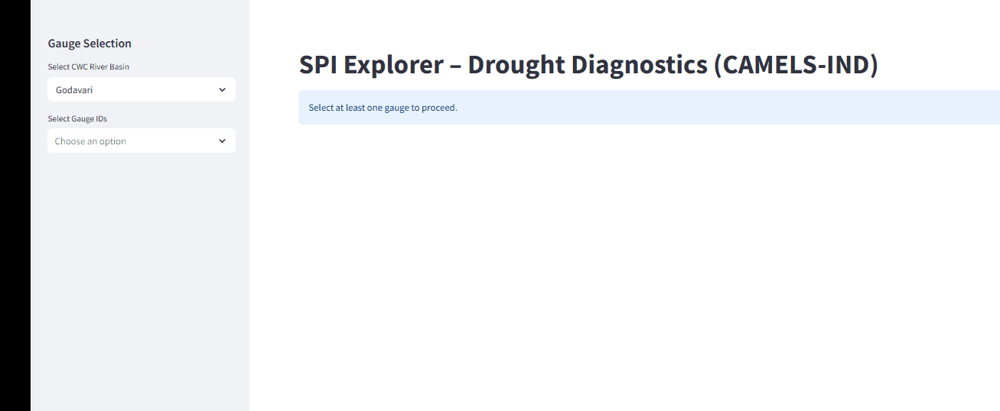

# SPI-Explorer — Drought Diagnostics (CAMELS-IND)

An interactive Streamlit app for diagnosing **seasonal drought non-stationarity** using the **Standardized Precipitation Index (SPI)** across Indian river basins based on the **CAMELS-IND** dataset.

This repository provides **analysis code only** and is intended as a **research companion tool**.

---

## Demo



---

## Features

* SPI computation at 1, 3, 6, and 12-month scales
* User-defined SPI baseline period
* Seasonal (month-specific) distribution comparison
* Temporal split (pre vs post) diagnostics
* Overlayed SPI distribution plots (KDE)
* Interactive basin and gauge selection
* CSV export of SPI and hydro-climatic variables

---

## How it works

1. Daily precipitation is aggregated to **monthly totals**
2. SPI is computed using a Gamma distribution fitted over a fixed baseline
3. The SPI series is split into **pre- and post-user-defined years**
4. A calendar month is selected
5. **Pre/Post SPI distributions are compared visually**

Ill-conditioned cases (e.g. insufficient data) are explicitly flagged.

---

## Run locally

```bash
pip install -r requirements.txt
streamlit run streamlit_app.py

```markdown
## Run locally

```bash
pip install -r requirements.txt
streamlit run streamlit_app.py
```

## Repository structure

```
spi-lab/
├── assets/            # demo.gif and UI assets
├── data/              # CAMELS-IND attributes & forcings (not redistributed)
├── utils/             # SPI computation utilities
├── streamlit_app.py   # main Streamlit app
└── README.md
```

## Data usage & licensing

This repository **does not redistribute CAMELS-IND data**.

The CAMELS-IND dataset is governed by its original license and terms of use. This repository does not redistribute the dataset and provides analysis code only. Users are responsible for obtaining the data from official sources and complying with the dataset’s licensing conditions.

This repository provides **code only**.

## Code license

MIT License — applies **only to the source code** in this repository.

## Citation

If you use this tool in academic work, please cite the CAMELS-IND dataset:

> https://doi.org/10.5194/essd-17-461-2025
```
